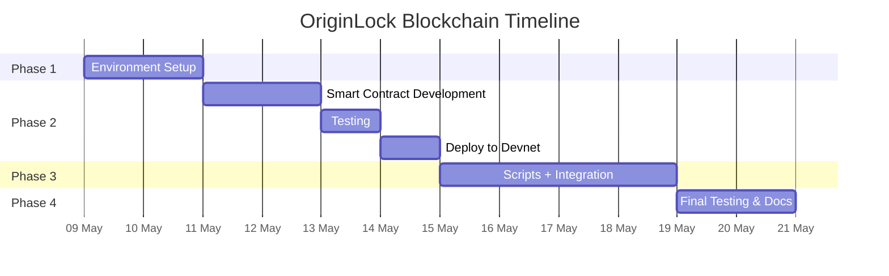

# OriginLock — Blockchain Roadmap

> **Milestone:** MVP for Hackathon  
> **Timeline:** 10–13 days total, working in parallel with other teams

---

## Timeline



---

## Milestones

| Milestone | Target Date | Deliverable |
|-----------|-------------|-------------|
| **M1: Tools Ready** | Day 2 | Solana + Anchor installed, wallet funded, `anchor build` works |
| **M2: Contract Deployed** | Day 6 | OriginLock program live on Devnet, tests passing |
| **M3: Integration Ready** | Day 10 | IDL exported, verify CLI tool works, documentation done |
| **M4: MVP Complete** | Day 13 | All tests green, README complete, demo flow verified |

---

## Phase Breakdown

### Phase 1 — Environment Setup (Days 1–2)

```
Day 1: Solana CLI, wallet, airdrop
Day 2: Anchor CLI, scaffold, build verification
```

### Phase 2 — Core Foundation (Days 3–6)

```
Day 3: Write Anchor program (register_idea, verify_ownership)
Day 4: Write test suite, run locally
Day 5: Debug and fix failing tests
Day 6: Deploy to Devnet, update Program ID
```

### Phase 3 — MVP Integration (Days 7–10)

```
Day 7:  Verify script, export ABI/IDL
Day 8:  Error path testing, Edge cases
Day 9:  Solana Explorer verification
Day 10: Documentation, README
```

### Phase 4 — Finalization (Days 11–13)

```
Day 11: Full test suite pass
Day 12: Integration with Frontend + Backend
Day 13: Final cleanup, demo prep
```

---

## Dependencies

| This needs... | From... | By when |
|---------------|---------|---------|
| Solana wallet address | Blockchain (self) | Day 2 |
| Program ID | Blockchain (self) | Day 6 |
| IDL/ABI JSON | Blockchain → Frontend | Day 7 |
| Deploy confirmation | Blockchain (self) | Day 6 |

---

## Risk Register

| Risk | Likelihood | Impact | Mitigation |
|------|-----------|--------|------------|
| Anchor CLI fails on Windows | High | High | Use WSL2 or fallback to manual build |
| Devnet congestion/slowdown | Medium | Medium | Deploy early, use priority fees |
| Insufficient Devnet SOL | Low | Low | Multiple faucets, request daily |
| Breaking Anchor upgrade | Low | High | Pin Anchor version in `Anchor.toml` |
